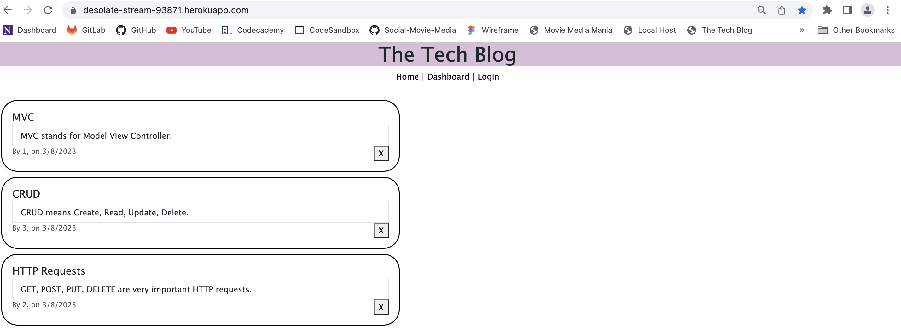
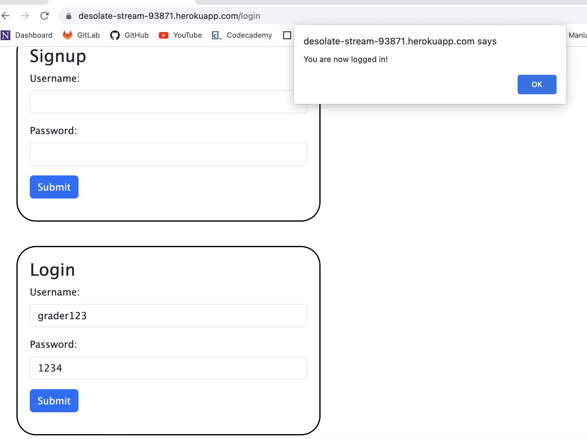
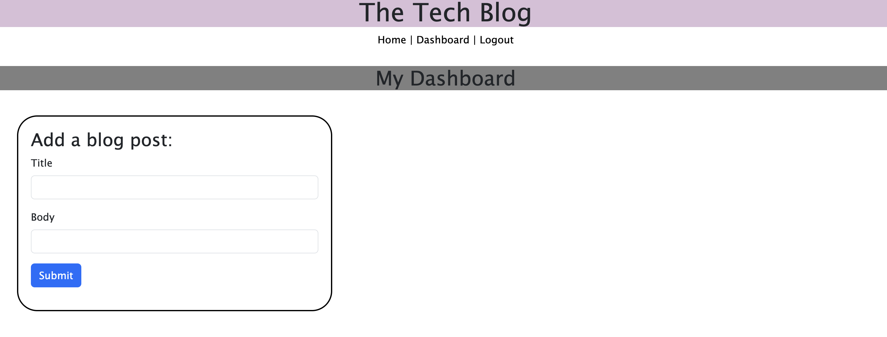
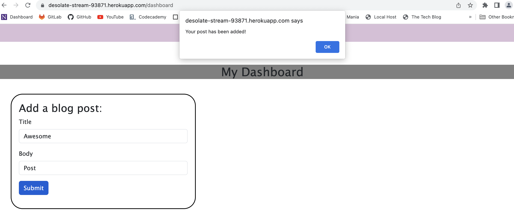
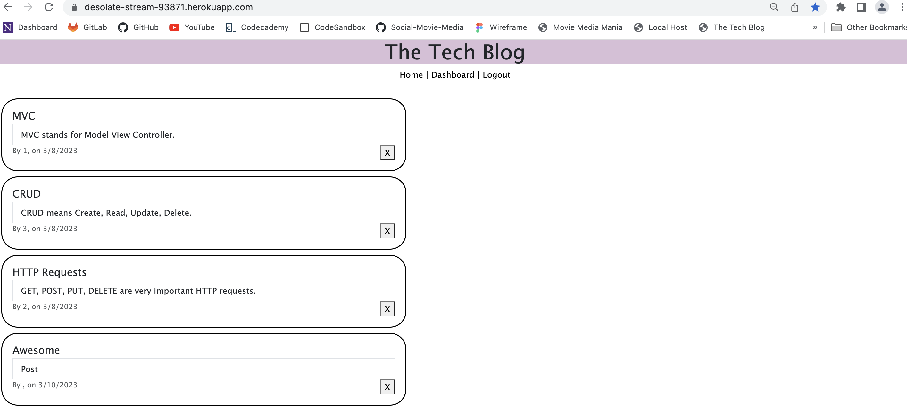
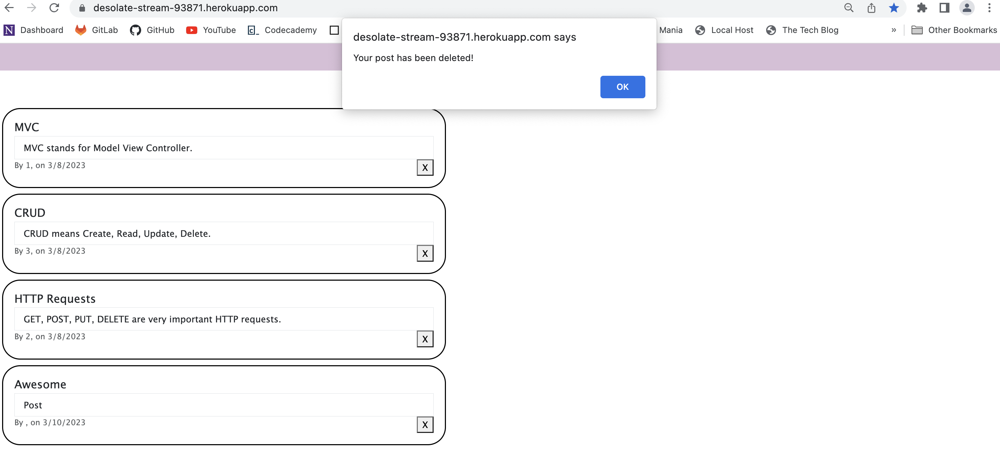
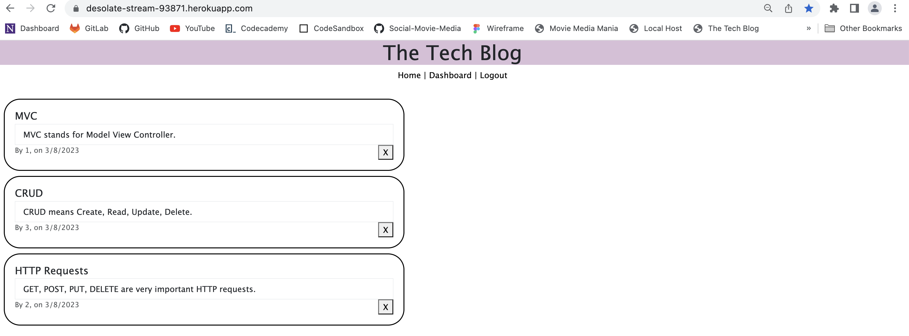
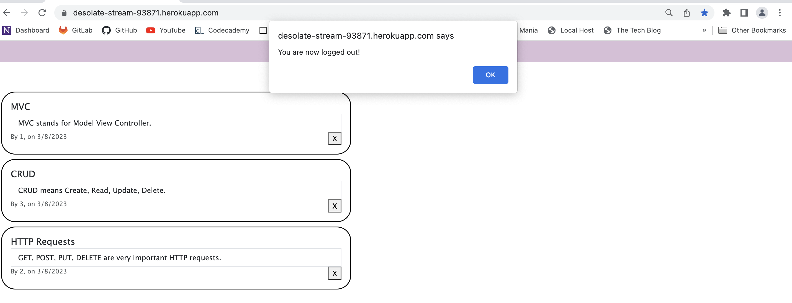
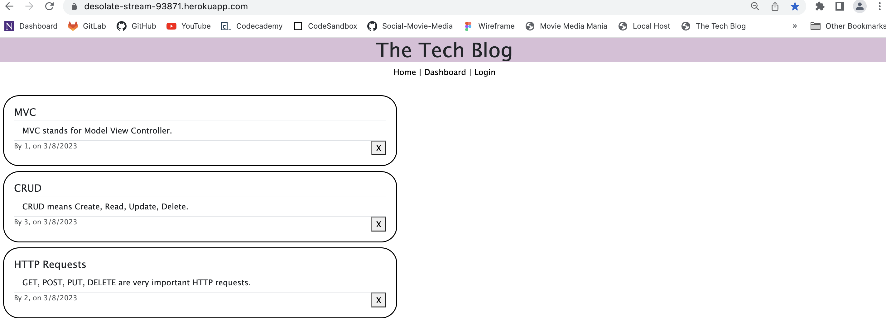

# Tech-Blog

## Description

- The purpose of this repository is for a developer who writes about tech
requesting a CMS-style blog site so that they can publish articles, blog posts, and their thoughts and opinions.
- This is done by building a CMS-style blog site, following the MVC paradigm in its architectural structure, using Handlebars.js as the templating language, Sequelize as the ORM, and the express-session npm package for authentication.

## Usage

- [Click here](https://desolate-stream-93871.herokuapp.com/) to navigate to the live link of this repository.

## Testing

The following account has been created for your convienence to test the application:

- Username: grader123
- Password: 1234

---------------------------

- You are presented with a page with already displayed posts:

---------------------------

- When you click on **Login** from the navigation bar, you are presented with a Signup form and a Login form:

---------------------------

- Once logged in, you will be directed to your dashboard, with a add post blog form:

---------------------------

- When you add a post, you will get a confirmation message:

---------------------------

- And your blog post will be added to the post list:

---------------------------

- When you click on the X button, your post will be deleted and you will get a confirmation message:

- Please note that it displays the date of creation.

---------------------------

- And your blog post will be deleted from the post list:

---------------------------

- When you click on **Logout** from the navigation bar,, you will be logged out from your session and will get a confirmation message:

---------------------------

- And will be redirected to the main page, with **Login** showing up again in the navigation bar:

---------------------------

## Credit

### Resources :books:
- Bootcamp Materials
- Review by instructor in office hours.
- Demonstration by TA in class
- The following folders were provided by TA in class: *config*, *db*, *models*, *utils*, and *.env* file.
- Tutor
- AskBCS Learning Assistants

### Assets :sparkles:
- [Bootstrap](https://getbootstrap.com/) Framework
- [Express Handlebars](https://www.npmjs.com/package/express-handlebars) Package
- [MySQL2](https://www.npmjs.com/package/mysql2) Package
- [Sequelize](https://www.npmjs.com/package/sequelize) Package
- [dotenv](https://www.npmjs.com/package/dotenv) Package
- [bcrypt](https://www.npmjs.com/package/bcrypt) Package
- [express-session](https://www.npmjs.com/package/express-session) Package
- [connect-session-sequelize](https://www.npmjs.com/package/connect-session-sequelize) Package

### Applications Used :gear:
- VS Code
- Heroku

Thank you for visiting! :ribbon:
